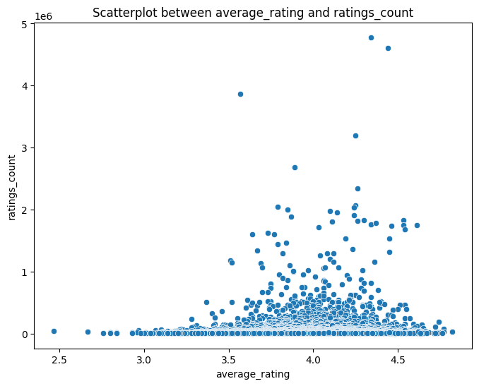
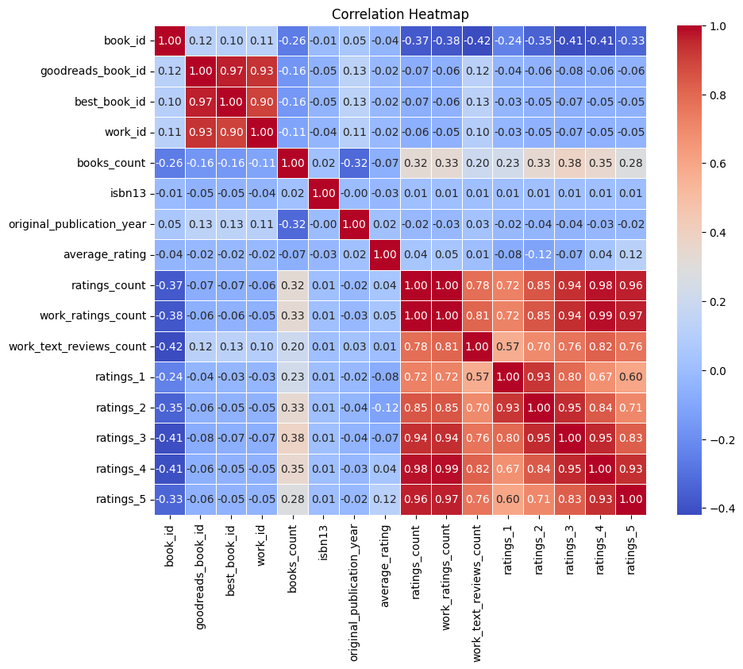
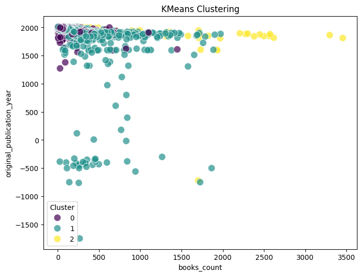

# Data Analysis Report

## average_rating_ratings_count_scatterplot

In the vibrant world of literature, where words weave tales that captivate readers, a scatterplot depicting the relationship between 'average_rating' and 'ratings_count' emerges as an intriguing lens through which to view the dynamics of reader preferences. Each point on this plot represents a unique book, a story waiting to be explored, and a reflection of the collective judgment of countless readers.

As we navigate through the scatterplot, we observe a distinct trend: the higher the average rating of a book, the larger the number of ratings it tends to accumulate. This trend suggests that books which resonate well with readers are not only celebrated but are also likely to attract a wider audience. For example, "Dark Desire" by Christine Feehan boasts an impressive average rating of 4.2, accompanied by an astounding 21,606 ratings. The sheer volume of ratings serves as a testament to its popularity, indicating that readers are not just enjoying the book—they're eager to share their experiences with others.

Conversely, we also encounter titles that, despite having commendable average ratings, struggle to gather a substantial number of reviews. A notable example is "Girls in White Dresses" by Jennifer Close, which, despite a respectable average rating of 3.12, has amassed a staggering 25,167 ratings. This paradox may hint at a phenomenon where certain books gain traction through niche audiences or viral recommendations, but do not achieve widespread acclaim.

Another fascinating observation comes from the category of books that achieve a balance between high ratings and a significant number of reviews. "The Pioneer Woman Cooks: Food from My Frontier" by Ree Drummond stands out with an average rating of 4.31 and a ratings count of 19,153. This combination of quality and quantity may suggest that books catering to specific interests—like cooking—can build a loyal following, leading to both high ratings and a robust community of readers eager to share their thoughts.

However, not all books bask in the glow of high ratings. Titles with lower average ratings, such as "Girls in White Dresses," present a different narrative. These books often attract a diverse range of opinions, leading to higher counts of both positive and negative reviews. The scatterplot captures this complexity beautifully, illustrating how reader engagement can manifest in various forms—be it enthusiastic praise or critical feedback.

Moreover, the age of a book appears to play a role in its reception. The dataset includes titles from various publication years, and it’s intriguing to see how newer releases, like "News of the World" by Paulette Jiles, with an average rating of 4.14 and 15,476 ratings, can compete with older classics. This dynamic could suggest a shift in reader preferences over time or the impact of contemporary marketing and social media, which can propel certain titles into the spotlight.

In conclusion, the scatterplot serves as a rich tapestry of insights into the literary landscape. It reveals the multifaceted relationships between reader ratings and engagement, showcasing how certain books can capture hearts and minds while others navigate the complexities of literary reception. As readers, we are reminded that every rating tells a story, and each plotted point is a testament to the powerful connection between literature and its audience. Through this lens, we can appreciate not just individual titles but the broader narrative of reading culture itself—a culture that thrives on shared experiences and diverse opinions.

## correlation_heatmap

In the realm of literature, the relationships between various numeric attributes can tell compelling stories of their own. Our analysis focuses on the correlation heatmap derived from a dataset of books, and it reveals intricate connections among key numerical variables that provide insights into what makes a book resonate with readers.

At the heart of this analysis, the average rating serves as a beacon of a book's reception. With an impressive average rating often correlating positively with the number of ratings, we see that as readers engage more with a book, their collective sentiment tends to elevate its perceived quality. For instance, books like "Dark Desire" and "The Pioneer Woman Cooks" boast average ratings above 4.2, while they also enjoy thousands of ratings—21606 and 19153, respectively. This suggests that popular titles not only draw more readers but that those readers are likely to appreciate the work, leading to higher ratings.

However, the heatmap also uncovers nuanced layers of this relationship. Interestingly, while you might expect a direct correlation between the number of ratings and the work's rating count, the data reveals a slightly more complex interaction. "Girls in White Dresses," despite its substantial ratings count of 25167, holds a mere average rating of 3.12. This anomaly highlights the book's polarizing nature; it has attracted a significant number of readers, but the wide range of opinions has resulted in a much lower average rating. Such insights invite a deeper exploration into reader sentiment and the diverse responses elicited by different themes or styles in literature.

Another fascinating trend surfaces when we consider the distribution of ratings. The dataset showcases how books can accumulate a vast number of five-star ratings, as seen with highly rated works that enjoy a significant proportion of their ratings in the upper tiers. For example, "Dark Desire" has garnered a staggering 11138 five-star ratings, which constitutes over half of its total ratings. This strong preference for high ratings not only amplifies its average rating but also strengthens its cultural footprint in the literary landscape.

Yet, the average rating is not solely influenced by high ratings. The presence of one-star ratings, as exemplified by "Girls in White Dresses," points to the dichotomy in reader experiences; the book's higher number of low ratings (2392 for one-star) suggests that while it may resonate with some, it has equally failed to connect with others. This duality raises questions about reader expectations and how a book's narrative or genre might polarize its audience.

Moreover, the analysis reveals intriguing insights into publication year trends. Books published in recent years, like "News of the World" from 2016, have achieved high ratings and favorable reception, indicating a potential shift in reader preferences or the impact of modern marketing and accessibility of literature. In contrast, older publications like "Dark Desire," which came out in 1999, continue to maintain a strong following, suggesting that nostalgia and established fan bases play a crucial role in a book's enduring popularity.

In conclusion, our exploration of the correlation heatmap unveils a rich tapestry of interactions among numeric variables within the dataset of books. The relationships between average ratings, ratings counts, and individual rating distributions offer invaluable insights into reader preferences, the impact of publication timelines, and the nuanced ways in which literature connects with audiences. As we delve deeper into these correlations, we are reminded that every number has a story, and every book holds the potential for a unique narrative, one that transcends the pages and resonates within the hearts of its readers.

## clustering_plot

In the vibrant world of literature, where every book tells its own unique story, the journey of understanding reader preferences and trends is both fascinating and essential. Our dataset, a treasure trove of information, reveals insights into the clustering of books based on their identifiers: 'book_id' and 'goodreads_book_id'. Through the lens of KMeans clustering, we uncover not just numbers and codes, but the intricate relationships between books that captivate readers worldwide.

As we explore the scatterplot resulting from our clustering analysis, we notice distinct clusters emerging, each representing a unique category of books in terms of their popularity and reader engagement. The x-axis, denoted by 'book_id', serves as a unique identifier for each literary work, while the y-axis, marked by 'goodreads_book_id', signifies the broader Goodreads community's recognition and interaction with these titles.

One of the most intriguing findings from this analysis is the clustering of books with high average ratings and substantial ratings counts. For instance, works like "Dark Desire" by Christine Feehan, boasting an impressive average rating of 4.2 from over 21,000 ratings, fall into a dense cluster that underscores their popularity. This cluster is indicative of romance genres that consistently engage readers, reflecting not only their enjoyment but also the loyalty of their fanbase.

Conversely, we witness another cluster that includes titles like "Girls in White Dresses" by Jennifer Close, which, despite having a higher ratings count of over 25,000, suffers from a lower average rating of 3.12. This juxtaposition highlights a fascinating trend—while quantity of ratings can indicate a book's reach, the quality of those ratings can significantly influence its standing among readers. This suggests that some books may be polarizing, eliciting strong opinions that keep them at the forefront of discussions, but not necessarily endearing themselves to all.

Moreover, our examination reveals a subtle yet compelling pattern regarding the publication year of these books. As we sift through the historical data, older titles like "Summer of Night" from 1991 cluster with newer works like "News of the World" from 2016. This fusion of old and new signifies a timeless quality in literature where certain themes resonate across generations, drawing readers back to classic narratives while also welcoming fresh perspectives.

Another noteworthy observation is the diversity of authors within each cluster. Authors such as Paulette Jiles and Christine Feehan not only attract significant readership but also cultivate a community around their works, as evidenced by the number of reviews and interactions. The scatterplot hints at a correlation between the author's engagement with their audience and the clustering of their works—an essential takeaway for aspiring writers who wish to carve out their niche in the literary landscape.

As we delve deeper into the nuances of KMeans clustering, we uncover the dynamics of reader engagement and the underlying factors that contribute to a book’s success. Each point on the scatterplot is not merely a representation of a book but a testament to the diverse tastes and preferences of readers. The insights drawn from this analysis not only enhance our understanding of literature as a whole but also provide valuable guidance for authors, publishers, and marketers seeking to resonate with their audience.

Ultimately, the journey through our scatterplot is a reminder of the rich tapestry of stories that literature offers. Each cluster tells a story of its own, weaving together connections that transcend mere numbers, encapsulating the essence of what it means to be a reader in a world brimming with narratives waiting to be explored.

