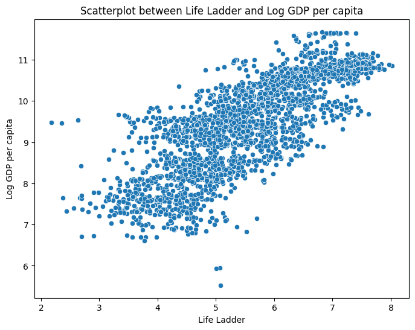
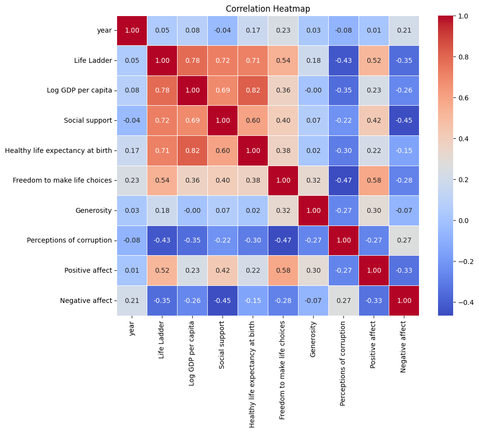
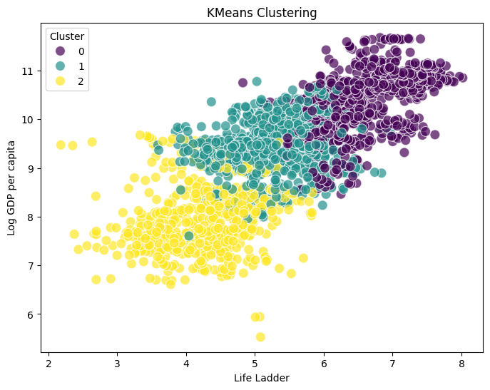

# Data Analysis Report

## Life_Ladder_Log_GDP_per_capita_scatterplot

In the realm of well-being and happiness, the “Life Ladder” serves as a powerful metaphor for how individuals perceive their lives, akin to ascending a staircase where each rung represents a higher level of contentment and fulfillment. The scatterplot comparing ‘Life Ladder’ scores against various countries paints a compelling picture of how socio-economic factors shape the subjective well-being of populations across different contexts.

As we delve into the dataset, the first striking observation is the remarkable variation in the Life Ladder scores among countries. For instance, Japan, in 2022, stands out with a Life Ladder score of 6.178, reflecting its advanced socio-economic status and robust social support systems. This high score is underpinned by a Log GDP per capita of 10.637, which suggests that economic prosperity translates into a greater sense of life satisfaction. Coupled with a healthy life expectancy of 74.475 years, it becomes evident that a combination of wealth and health contributes significantly to the happiness of its citizens.

In contrast, we encounter Peru in 2006, with a Life Ladder score of 4.811. This lower score highlights the challenges faced by the country, despite a respectable Log GDP per capita of 8.979. While Peruvian citizens experience a fair level of social support (0.875) and a healthy life expectancy of 66.46 years, the overall perception of life satisfaction remains depressed, indicating that economic growth alone does not guarantee happiness. Notably, the perceptions of corruption (0.895) suggest that trust in institutions also plays a pivotal role in shaping life satisfaction.

Then there is Trinidad and Tobago, which in 2017 presented a Life Ladder score of 6.192. This score reveals an interesting narrative, as the country boasts high social support (0.916) and a Log GDP per capita of 10.174. Here, the high degree of freedom to make life choices (0.859) and a relatively low negative affect (0.248) contribute to a perception of happiness that is not solely reliant on economic metrics. This suggests that cultural factors and community ties may provide a significant boost to life satisfaction in a way that transcends material wealth.

Thailand further enriches this exploration with a Life Ladder score of 6.231 in 2013. The high levels of social support (0.926) and positive affect (0.782) point to a society that values interpersonal relationships and well-being, despite a lower Log GDP per capita of 9.645. The combination of life choices freedom (0.781) and low negative affect (0.141) illustrates that happiness can flourish in environments where social connections and personal agency are prioritized.

Guatemala, showcasing a Life Ladder score of 6.262 in 2019, presents an intriguing case as well. Despite its lower Log GDP per capita of 9.068 and a healthy life expectancy of 62.3 years, the country manages to achieve a relatively high score on the Life Ladder, driven by robust social support (0.774) and a positive outlook (0.82). This points to resilience in the face of economic challenges, demonstrating how communal bonds and a positive mindset can elevate life satisfaction.

As we step back and analyze the scatterplot as a whole, a few key insights emerge. First, there appears to be a trend where countries with higher Log GDP per capita generally report higher Life Ladder scores. However, the exceptions highlight the importance of social support, freedom, and perceptions of corruption, suggesting that economic metrics alone do not capture the full scope of human happiness.

The data implores us to consider the complexity of well-being. While wealth provides a foundation, it is the social fabric, personal freedoms, and cultural context that weave the true tapestry of happiness. Countries like Thailand and Guatemala remind us that subjective well-being is a multifaceted phenomenon, influenced by a myriad of factors that extend beyond mere economics. As societies strive to climb their own ladders of life, the journey is as important as the destination, and the insights gleaned from this dataset illuminate the paths that lead to greater happiness and fulfillment.

## correlation_heatmap

In the world of data analysis, a correlation heatmap serves as a vibrant tapestry, weaving together the intricate relationships between various numeric variables. The dataset at hand, rich with insights derived from countries across different years, offers a glimpse into the complex interplay of life satisfaction, economic prosperity, social support, and well-being.

As we explore the heatmap, we begin with a striking observation: there is a notable positive correlation between **Life Ladder**—a measure of subjective well-being—and **Log GDP per capita**. This suggests that as countries enjoy greater economic prosperity, their citizens tend to report higher satisfaction with their lives. For example, Japan in 2022, with a Life Ladder score of 6.178 and a Log GDP per capita of 10.637, exemplifies this trend. It is a reminder of the importance of economic stability in fostering happiness.

Delving deeper, we find that **Social support** is another pillar that significantly correlates with the Life Ladder. A robust support system appears to be a crucial factor in enhancing individuals' perceptions of their quality of life. Trinidad and Tobago, with a high social support score of 0.916, showcases a Life Ladder score of 6.192, reinforcing the idea that community and social ties are foundational to happiness.

Interestingly, the variable **Freedom to make life choices** also aligns positively with Life Ladder scores. Countries like Thailand, with a score of 0.781 in this category, reveal that personal agency in decision-making contributes favorably to life satisfaction. This correlation suggests that when individuals feel they have the autonomy to shape their lives, their overall happiness increases, emphasizing the significance of personal freedoms in societal well-being.

However, not all relationships are straightforward. The variable **Generosity** presents a mixed picture. While some countries exhibit a slight positive correlation with happiness, others reveal a negative relationship. For instance, Peru demonstrates a negative generosity score of -0.076, indicating that higher levels of generosity do not consistently translate to increased happiness, at least in this context. This complexity invites us to reflect on cultural nuances—what generosity means and how it is expressed across different societies may shape its impact on life satisfaction.

When we consider the emotional dimensions of happiness, **Positive affect** shows a strong positive correlation with the Life Ladder. This indicates that countries where individuals report higher levels of positive emotions tend to score higher on life satisfaction. Conversely, **Negative affect** has a negative correlation with the Life Ladder, suggesting that as feelings of negativity increase, life satisfaction tends to decline. This duality highlights the importance of emotional well-being in the broader context of subjective happiness, urging policymakers to foster environments that promote positive experiences while mitigating negative ones.

The variable **Perceptions of corruption** also plays a critical role in this narrative. With high corruption perceptions correlating negatively with life satisfaction, it's evident that trust in governmental and societal systems significantly impacts individual well-being. Countries with lower corruption perceptions often enjoy higher life satisfaction, as seen in the higher Life Ladder scores of nations like Thailand and Trinidad and Tobago.

In summary, this correlation heatmap not only uncovers patterns and relationships among the variables but also tells a compelling story of human experience. It underscores the intertwined nature of economic factors, social structures, personal freedoms, emotional health, and governance in shaping the happiness of individuals across different countries. As we reflect on these insights, we are reminded that the quest for well-being is a multifaceted journey, influenced by both tangible resources and intangible connections.

## clustering_plot

In the vibrant tapestry of global well-being, a recent analysis employing KMeans clustering has unveiled fascinating insights into how different countries have navigated their happiness and quality of life over the years. The scatterplot, which visualizes KMeans clustering results using 'Country name' and 'year', paints a compelling picture of how nations cluster together based on their socio-economic variables, revealing patterns that tell stories of progress, variance, and shared experiences.

At the heart of this analysis lies the concept of the "Life Ladder," a metric that captures subjective well-being. As we examine the scatterplot, we can identify distinct clusters that emerge from the data, suggesting similarities in life satisfaction among countries. Countries like Japan and Trinidad and Tobago, which are positioned in the higher echelons of the Life Ladder, demonstrate a correlation between economic prosperity, as indicated by their Log GDP per capita, and overall life satisfaction.

Take Japan, for instance. In 2022, it boasts a Life Ladder score of 6.178, coupled with a Log GDP per capita of 10.637—indicative of a robust economy. This is complemented by high social support and healthy life expectancy metrics, suggesting that the Japanese population enjoys not only wealth but also wellness. The year 2022 marks an interesting point, as Japan's focus on holistic well-being initiatives seems to have paid dividends in the happiness of its citizens.

Conversely, nations like Peru from 2006, with a Life Ladder score of 4.811, appear to be situated in a distinctly different cluster. Here, we observe a lower Log GDP per capita of 8.979 and a lower healthy life expectancy of 66.46 years. This contrast highlights the struggle that many developing nations face; despite social support that is relatively solid at 0.875, the overall quality of life may still fall short. Such findings prompt further exploration into the persistent challenges these nations encounter, such as systemic issues that inhibit greater freedoms and life choices.

The cluster analysis does not only reveal disparities but also offers rays of hope through emerging trends. For instance, countries like Thailand and Guatemala showcase life satisfaction scores that, while lower than their wealthier counterparts, are buoyed by strong social support systems and an apparent sense of freedom to make life choices. Thailand in 2013, with a Life Ladder of 6.231, exhibits a commendable balance between economic factors and social well-being, indicating that happiness does not solely hinge on wealth but is also influenced significantly by social constructs and community support.

Moreover, the data reveals intriguing patterns related to perceptions of corruption and generosity across these clusters. For example, countries with higher perceptions of corruption, such as Peru, still manage to showcase pockets of positive affect and social support, suggesting resilience among individuals despite systemic challenges. This resilience is a testament to human spirit and community strength, often unseen in aggregate data.

As we delve deeper into these clusters, we also observe the role of negative affect. Interestingly, nations like Japan and Trinidad and Tobago display lower instances of negative affect, aligning with their higher Life Ladder scores. This correlation highlights how emotional well-being is intricately tied to overall life satisfaction and societal structures that promote health and happiness.

In conclusion, the scatterplot reveals a rich narrative of how countries cluster based on their socio-economic indicators and subjective measures of happiness. The insights gleaned from this analysis underscore the complexity of well-being, showing that while economic indicators are crucial, the social fabric, perceptions of corruption, and emotional health are equally vital to understanding a country's overall happiness. As nations continue to evolve, these findings can guide policymakers in crafting initiatives that foster not just economic growth but holistic well-being for all citizens. The journey on the path to happiness is multifaceted, and this analysis illuminates the diverse roads that different countries traverse in pursuit of a better life.

