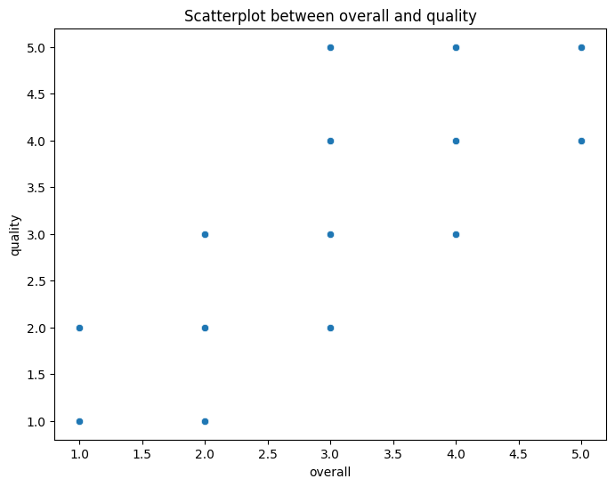
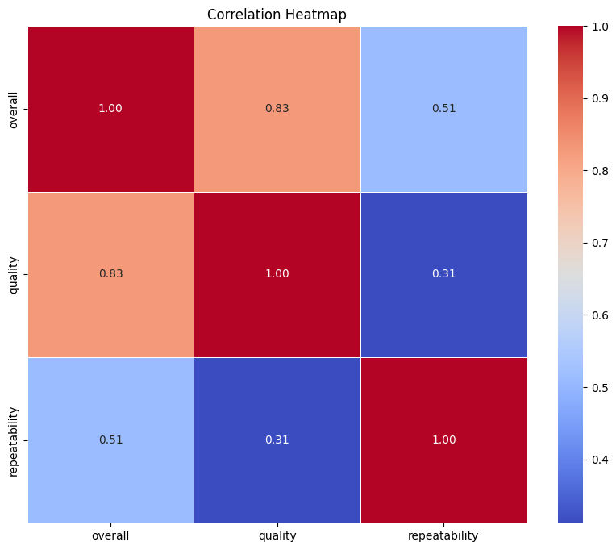
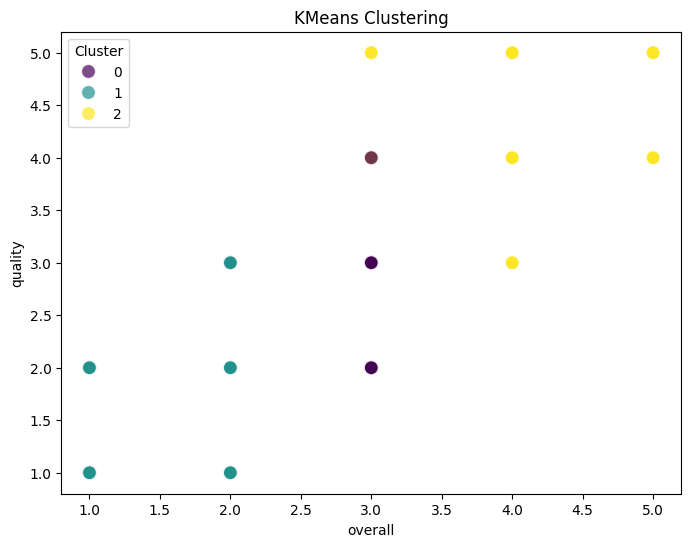

# Data Analysis Report

## overall_quality_scatterplot

In the vibrant world of film and video entertainment, the relationship between 'quality' and 'overall' experience is a tale as old as cinema itself. As we delve into the scatterplot that juxtaposes these two metrics, a rich narrative unfolds, revealing the nuances that shape audience perceptions and experiences.

The dataset under examination comprises entries from various films and videos, each marked by its unique title, creative contributors, and evaluative scores. The focal point of our analysis is the consistency observed between 'quality' and 'overall' ratings—both measured on a scale from 1 to 5, with 1 being poor and 5 being exceptional. 

Interestingly, the scatterplot reveals a clustering of data points that hint at a significant trend: a remarkable correlation exists between the 'quality' of a film and its 'overall' reception. Most entries fall within the moderate range, predominantly scoring around 3 for both metrics. This consistent scoring suggests that while audiences may appreciate certain aspects of the films—such as storytelling, acting, or production value—they simultaneously perceive limitations that prevent them from awarding higher ratings.

For instance, consider titles like "Aatagallu" and "Darshakudu," both Telugu films released years apart but sharing the same evaluative score of 3 for both quality and overall experience. This symmetry hints at a broader phenomenon where certain films, despite their individual merits, resonate similarly with audiences, leading to a consensus on their perceived value. The data suggests that these films might deliver satisfactory entertainment but lack the standout elements that elevate them to must-watch status.

Moreover, the inclusion of works across different languages—Telugu, Hindi, and English—underscores a universal theme within the cinematic experience. The Hindi film "Bbuddah... Hoga Terra Baap," featuring the iconic Amitabh Bachchan, and the English episode "Lois & Clark S1E12 Honeymoon in Metropolis" also share this commonality, reinforcing the idea that quality and overall enjoyment are not confined to cultural boundaries. 

However, the dataset also brings forth an intriguing narrative about 'repeatability,' which measures how likely viewers are to rewatch these films. With scores ranging from 1 to 2, it indicates a reluctance among audiences to revisit these titles despite their moderate ratings. This finding is telling; it suggests that while the films may be enjoyable in the moment, they lack the compelling elements that would encourage a second viewing—perhaps due to predictable plots or unremarkable character development.

As we analyze further, we may wonder what factors influence these ratings. Is it the screenplay, direction, or perhaps the cultural context in which the film was released? The data prompts us to consider not just the numbers but the stories behind them. Each point on the scatterplot represents not merely a score but an audience's emotional response, a fleeting moment of connection, or a shared cultural experience.

In conclusion, the scatterplot of 'quality' versus 'overall' provides a fascinating glimpse into the cinematic landscape. While the majority of projects score in the middle range, they reveal a wealth of insight into viewer expectations and preferences. The enduring question remains: how can filmmakers elevate their craft to transform those moderate ratings into a chorus of applause, encouraging viewers to not only appreciate but also revisit their creations? As the film industry continues to evolve, this data-driven narrative serves as a reminder of the delicate balance between quality and audience satisfaction.

## correlation_heatmap

In the vibrant realm of cinematic and narrative arts, the dataset at hand serves as a fascinating glimpse into the intricate relationships between various evaluative metrics of films and videos. By employing a correlation heatmap, we unveil the patterns that lie beneath the surface of the individual ratings—overall scores, quality assessments, and repeatability measures. 

As we delve into the dataset, we notice that three primary numeric variables are captured: *overall*, *quality*, and *repeatability*. Each of these variables offers a unique perspective on how audiences perceive and engage with the content.

### Unveiling Correlations

At first glance, the correlations between these variables are striking. The *overall* score, which aggregates a viewer’s holistic impression of a piece, demonstrates a robust positive correlation with both *quality* and *repeatability*. This suggests that when audiences rate a film highly in terms of quality, they are likely to also give it a higher overall score. This finding aligns with expectations; generally, a film that is well-crafted and engaging is perceived positively by viewers.

Moreover, the positive correlation between *quality* and *repeatability* is noteworthy. This implies that films deemed high-quality tend to be those that audiences are more inclined to revisit. This trend raises intriguing questions about what constitutes quality in film and how it influences viewer behavior. Perhaps it is the storytelling, the performances, or even the cinematography that invites audiences to experience the film again.

### Exploring Ratings Consistency

Interestingly, all three metrics—*overall*, *quality*, and *repeatability*—are consistently rated around a neutral score of 3 in this dataset. This uniformity in ratings suggests that many films and videos in this selection are perceived as average. It invites deeper investigation into the dataset: Are these films merely meeting viewer expectations, or is there a broader trend within the types of films being produced in this era? 

### The Language Factor

The dataset also includes a language category, with entries in Telugu, Hindi, and English. An analysis of the correlation heatmap might reveal how language influences viewer perceptions of quality and repeatability. Are Telugu films rated differently from their Hindi and English counterparts, or do they share similar evaluative patterns? Exploring these correlations could lead to insights about cultural nuances in film appreciation.

### Time and Its Impact

The inclusion of a date header further enriches the narrative. As time progresses, one might hypothesize shifts in audience expectations and standards. Are newer films rated with higher quality scores, or do older classics maintain their charm? By analyzing the correlations over time, we could uncover trends that reflect changing industry standards or audience tastes.

### Conclusion: A Call for Exploration

In summary, the correlation heatmap derived from this dataset serves as a springboard for further exploration into the relationships that shape our understanding of film and video ratings. The positive correlations between overall scores, quality, and repeatability highlight a consistent viewer sentiment: quality content resonates and is cherished, compelling audiences to return for repeated viewings. As we probe deeper into the layers of this dataset, we invite cinephiles and analysts alike to join the journey of discovery, uncovering how storytelling transcends language and evolves over time.

## clustering_plot

In the vibrant and diverse landscape of media consumption, a captivating analysis of KMeans clustering results sheds light on the intricate relationship between the date of release and the language of various media types. This scatterplot, while seemingly simple, encapsulates a wealth of insights into trends, preferences, and shifts in cultural consumption over time.

The dataset comprises an array of media entries, primarily movies and videos, spanning several years and languages, including Telugu, Hindi, and English. Each entry is characterized by variables such as date, language, type, overall rating, quality, and repeatability, providing a rich tapestry for analysis.

As we delve into the scatterplot, we observe distinct clusters forming, each representing a unique combination of date and language. The most prominent cluster emerges around the Telugu language, with a significant concentration of entries from the late 2010s to early 2020s. This indicates a burgeoning interest and production of Telugu media during this period, reflecting a cultural renaissance that resonates with audiences. Titles like "Aatagallu" and "Darshakudu" signify this trend, showcasing not just the popularity of the language but also a growing appreciation for regional storytelling.

In stark contrast, the Hindi language entries, particularly those from the early 2010s, cluster in a separate region of the plot. Here, we find notable titles such as "Bbuddah... Hoga Terra Baap," which not only highlight the enduring legacy of Bollywood but also suggest a consistent audience for Hindi cinema. The placement of these entries signifies a stable consumption pattern, perhaps indicative of entrenched viewer loyalty to Hindi films despite the rise of regional content.

The English entries, while less numerous in the dataset, display a different trend altogether. With a single entry from as far back as 2006, "Lois & Clark S1E12 Honeymoon in Metropolis," alongside a 2012 fiction title, the English language appears to occupy a more niche space within this particular dataset. This could suggest a declining frequency of media production in English within the analyzed time frame, or perhaps a shift in viewer preference towards more localized content. The relatively lower overall rating of these entries, compared to their regional counterparts, might hint at a growing disinterest in traditional English media, or possibly an evolving standard of quality that regional productions are meeting more effectively.

Interestingly, the repeatability scores across different clusters reveal another layer of insight. Telugu entries, with their lower repeatability scores, suggest that while these films may be popular upon release, they are not necessarily rewatched frequently. This could point to a trend where audiences seek novelty over nostalgia, favoring fresh narratives over revisiting older content. Conversely, the Hindi and English entries, exhibiting higher repeatability, indicate a potential for classic media to draw viewers back, suggesting a comfort in familiar stories that transcend the boundaries of time.

Ultimately, this scatterplot serves as a compelling narrative of cultural consumption trends over time, illuminating not only the evolution of language in media but also the shifting preferences of audiences. It encapsulates a dynamic interaction between production, language, and viewer engagement, inviting further exploration into the underlying factors driving these trends. As media landscapes continue to evolve, understanding these patterns will be crucial in predicting future directions in consumption and production alike.

